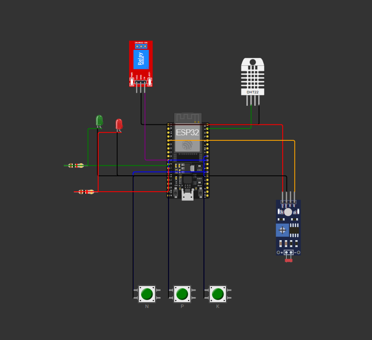

# FarmTech Solutions - Sistema de Irrigacao Inteligente

Sistema de irrigacao inteligente para cultivo de **tomate**, desenvolvido com **ESP32 DevKit C v4** utilizando o framework Arduino e a plataforma **PlatformIO**. O projeto monitora as condicoes do solo (umidade, pH e nutrientes NPK) e controla automaticamente uma bomba d'agua por meio de um modulo rele, garantindo irrigacao eficiente e segura.

Simulacao disponivel no Wokwi: [https://wokwi.com/projects/459600919819279361](https://wokwi.com/projects/459600919819279361)

---

## Circuito e Diagrama

### Visao geral do circuito (Wokwi)




> Para interagir com o circuito em tempo real, acesse a [simulacao no Wokwi](https://wokwi.com/projects/459600919819279361).

---

## Componentes e Mapeamento de Pinos

| Componente | Tipo/Modelo | Pino GPIO | Funcao |
|---|---|---|---|
| Microcontrolador | ESP32 DevKit C v4 | - | Controlador principal |
| Sensor de Umidade | DHT22 | GPIO 23 | Leitura de umidade do solo |
| Sensor de pH (simulado) | LDR (Fotoresistor) | GPIO 34 (ADC) | Simula leitura de pH do solo |
| Botao Nitrogenio (N) | Push Button (verde) | GPIO 4 | Toggle presenca de Nitrogenio |
| Botao Fosforo (P) | Push Button (verde) | GPIO 5 | Toggle presenca de Fosforo |
| Botao Potassio (K) | Push Button (verde) | GPIO 18 | Toggle presenca de Potassio |
| Modulo Rele | Relay Module | GPIO 26 | Controle da bomba d'agua |
| LED Verde | LED | GPIO 27 | Indicador de irrigacao ativa |
| LED Vermelho | LED | GPIO 14 | Alerta critico |
| Resistor LED Verde | 220 Ohm | - | Protecao do LED verde |
| Resistor LED Vermelho | 220 Ohm | - | Protecao do LED vermelho |

### Esquema de conexoes

```
ESP32 GPIO 23  ── SDA ──> DHT22 (VCC -> VIN, GND -> GND)
ESP32 GPIO 34  ── AO  ──> LDR   (VCC -> 3V3, GND -> GND)
ESP32 GPIO 4   ── 1.l ──> Botao N (2.l -> GND)
ESP32 GPIO 5   ── 1.l ──> Botao P (2.l -> GND)
ESP32 GPIO 18  ── 1.l ──> Botao K (2.l -> GND)
ESP32 GPIO 26  ── IN  ──> Relay  (VCC -> VIN, GND -> GND)
ESP32 GPIO 27  ── R220Ω ──> LED Verde (Catodo -> GND)
ESP32 GPIO 14  ── R220Ω ──> LED Vermelho (Catodo -> GND)
```

---

## Parametros Ideais para Tomate

| Parametro | Faixa Ideal | Unidade |
|---|---|---|
| pH do Solo | 5.5 - 7.0 | - |
| Umidade do Solo | 60% - 80% | % |
| Nutrientes (NPK) | >= 2 de 3 presentes | - |

---

## Logica de Irrigacao

### Quando a bomba LIGA

A bomba d'agua e acionada **somente** quando **todas** as condicoes abaixo sao atendidas simultaneamente:

1. Previsao de chuva **NAO** esta ativa
2. Umidade do solo **< 60%** (solo seco)
3. pH do solo entre **5.5 e 7.0** (faixa aceitavel)
4. Pelo menos **2 de 3** nutrientes (N, P, K) presentes

### Quando a bomba NAO liga

A bomba permanece desligada se **qualquer** uma destas condicoes for verdadeira:

- Umidade >= 80% (solo encharcado)
- pH fora da faixa 5.5 - 7.0 (necessita correcao do solo)
- Menos de 2 nutrientes presentes
- Previsao de chuva ativa (comando manual via Serial)
- Umidade entre 60% e 80% (zona de conforto, nao necessita irrigacao)

### Fluxograma de decisao

```
[Inicio]
   |
   v
Previsao de chuva ativa? ── SIM ──> Bomba OFF
   |
  NAO
   |
   v
Umidade >= 80%? ── SIM ──> Bomba OFF
   |
  NAO
   |
   v
pH fora de 5.5-7.0? ── SIM ──> Bomba OFF
   |
  NAO
   |
   v
Nutrientes < 2? ── SIM ──> Bomba OFF
   |
  NAO
   |
   v
Umidade < 60%? ── SIM ──> Bomba ON
   |
  NAO (60-80%, zona confortavel)
   |
   v
Bomba OFF
```

### Sistema de alertas (LED Vermelho)

O LED vermelho acende quando:
- pH esta **fora** da faixa ideal (< 5.5 ou > 7.0), **OU**
- Numero de nutrientes presentes e **menor que 2**

> O LED vermelho e **desligado** automaticamente quando a previsao de chuva esta ativa, pois os alertas nao sao acionaveis durante chuva.

---

## Detalhamento dos Sensores

### DHT22 - Umidade do Solo

- **Pino:** GPIO 23
- **Biblioteca:** DHT sensor library (Adafruit)
- **Leitura:** Umidade relativa em porcentagem (%)
- **Intervalo:** A cada 2 segundos
- **Tratamento de erro:** Se a leitura falhar, retorna -1 e exibe mensagem de erro no Serial. O ciclo e interrompido ate a proxima leitura valida.

### LDR (Fotoresistor) - pH do Solo (Simulado)

- **Pino:** GPIO 34 (entrada analogica ADC)
- **Leitura analogica:** 0 a 4095 (resolucao de 12 bits do ESP32)
- **Mapeamento:** Valor analogico convertido linearmente para escala de pH (0.0 a 14.0) usando a funcao `mapFloat()`
- **No Wokwi:** Ajuste o slider do LDR para simular diferentes valores de pH do solo

> **Nota:** O LDR nao mede pH real. Esta e uma estrategia de simulacao utilizada porque o Wokwi nao possui um componente de sensor de pH. Em uma implementacao real, seria utilizado um sensor de pH analogico (ex: PH-4502C).

### Botoes NPK (Nitrogenio, Fosforo, Potassio)

- **Pinos:** GPIO 4 (N), GPIO 5 (P), GPIO 18 (K)
- **Configuracao:** `INPUT_PULLUP` (ativo em LOW)
- **Funcionamento:** Toggle - cada pressionamento alterna o estado do nutriente entre PRESENTE e AUSENTE
- **Debounce:** 200ms para evitar leituras multiplas por pressionamento mecanico
- **Contagem:** A funcao `contarNutrientes()` soma quantos dos 3 nutrientes estao ativos

> **Nota:** Em uma implementacao real, sensores de NPK (como o sensor de solo NPK RS485) substituiriam os botoes, fornecendo leituras automaticas dos niveis de nutrientes.

---

## Atuadores

### Modulo Rele - Bomba d'Agua

- **Pino:** GPIO 26
- **HIGH** = Bomba ligada (irrigacao ativa)
- **LOW** = Bomba desligada
- Controlado pela funcao `decidirIrrigacao()`

### LED Verde (GPIO 27)

- Acende quando a bomba esta **ligada** (irrigacao em andamento)
- Apaga quando a bomba esta desligada
- Protegido por resistor de 220 Ohm

### LED Vermelho (GPIO 14)

- Acende quando ha **alerta critico** (pH fora da faixa ou nutrientes insuficientes)
- **Desliga** durante previsao de chuva (alertas suprimidos)
- Protegido por resistor de 220 Ohm

---

## Comandos Serial

| Comando | Funcao | Descricao |
|---|---|---|
| `C` ou `c` | Ativar previsao de chuva | Bomba desliga, alertas do LED vermelho suprimidos |
| `S` ou `s` | Desativar previsao de chuva (sol) | Retorna ao modo normal de operacao |

- **Baud rate:** 115200
- **Intervalo de leitura:** Status exibido a cada 2 segundos
- **Feedback dos botoes:** Cada toggle de nutriente gera uma mensagem no Serial

### Exemplo de saida do Monitor Serial

```
===========================================
  FarmTech Solutions - Irrigacao Inteligente
  Cultura: Tomate
===========================================

Comandos via Serial:
  'C' -> Ativar previsao de chuva
  'S' -> Desativar previsao de chuva (sol)

Botoes NPK: clique para alternar ON/OFF

-------------------------------------------
         LEITURA DOS SENSORES
-------------------------------------------
  Nitrogenio (N): PRESENTE [ON]
  Fosforo    (P): PRESENTE [ON]
  Potassio   (K): AUSENTE  [OFF]
  Nutrientes OK:  2/3
  pH do Solo:     6.3 (ideal: 5.5 - 7.0)
  Umidade Solo:   45.0% (ideal: 60% - 80%)
-------------------------------------------
  >> BOMBA D'AGUA: *** LIGADA ***
-------------------------------------------
```

---

## Como Executar

### Pre-requisitos

- [VS Code](https://code.visualstudio.com/) com extensao [PlatformIO IDE](https://platformio.org/install/ide?install=vscode)
- Extensao [Wokwi para VS Code](https://docs.wokwi.com/vscode/getting-started) (opcional, para simulacao local)
- Ou acesso ao [Wokwi Online](https://wokwi.com)

### Compilar e Upload (PlatformIO)

```bash
# Clonar o repositorio
git clone <url-do-repositorio>
cd arduino-claude-example

# Compilar
pio run

# Upload para ESP32 fisico (se disponivel)
pio run --target upload

# Monitor serial
pio device monitor --baud 115200
```

### Simulacao no Wokwi

#### Opcao 1: Wokwi Online

1. Acesse: [https://wokwi.com/projects/459600919819279361](https://wokwi.com/projects/459600919819279361)
2. Clique em **Start Simulation** (botao verde ▶)
3. Use os botoes **N**, **P**, **K** para alternar nutrientes
4. Ajuste o **slider do LDR** para simular diferentes valores de pH
5. Envie `C` ou `S` pelo **Monitor Serial** para simular previsao de chuva/sol

#### Opcao 2: Wokwi no VS Code

1. Instale a extensao **Wokwi Simulator** no VS Code
2. Compile o projeto com PlatformIO (`pio run`)
3. Execute o comando **Wokwi: Start Simulator**
4. O arquivo `wokwi.toml` aponta para o firmware compilado em `.pio/build/esp32/`
5. O arquivo `diagram.json` define o layout do circuito

---

## Estrutura do Projeto

```
arduino-claude-example/
├── src/
│   └── prog1.ino            # Codigo-fonte principal (272 linhas)
├── images/
│   ├── circuito-wokwi.png           # Screenshot do circuito no Wokwi
│   └── circuito-wokwi-conexoes.png  # Detalhe das conexoes
├── diagram.json              # Definicao do circuito (formato Wokwi)
├── wokwi.toml                # Configuracao do simulador Wokwi
├── platformio.ini            # Configuracao do PlatformIO (board, libs)
├── libraries.txt             # Lista de dependencias
├── .gitignore                # Arquivos ignorados pelo Git
└── README.md                 # Este arquivo
```

---

## Dependencias

| Biblioteca | Versao | Finalidade |
|---|---|---|
| DHT sensor library (Adafruit) | >= 1.4.7 | Leitura do sensor DHT22 |
| Adafruit Unified Sensor | (dependencia) | Requerida pela biblioteca DHT |

Ambas sao instaladas automaticamente pelo PlatformIO via `lib_deps` no `platformio.ini`.

---

## Autores

**FarmTech Solutions**
